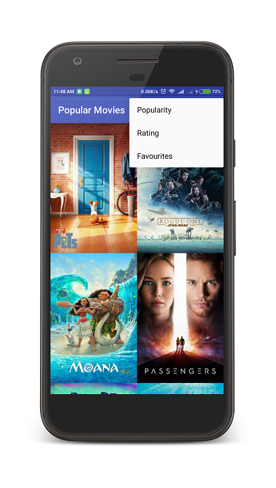
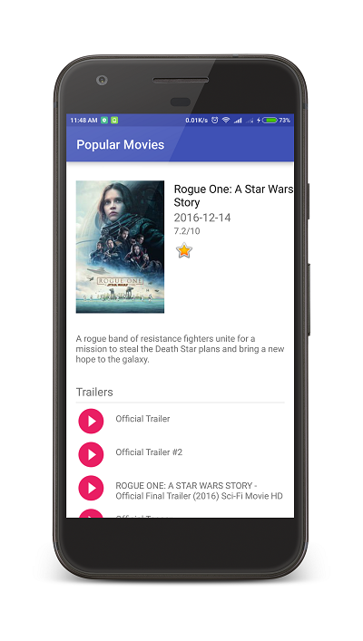
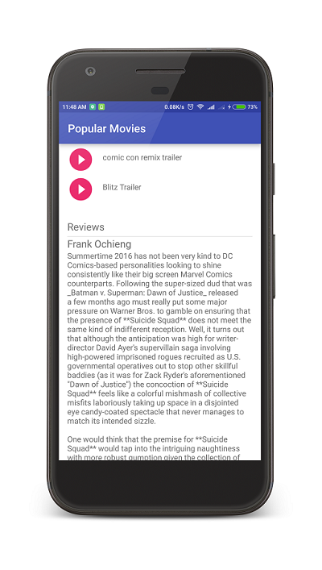

# PopularMovies

Popular Movies is an Android App, optimized for tablets, to help users discover popular and highly rated movies on the web. It displays a scrolling grid of movie trailers, launches a details screen whenever a particular movie is selected, allows users to save favorites, play trailers, and read user reviews. This app utilizes core Android user interface components and fetches movie information using themoviedb.org web API.

### Prerequisite
```
Insert TMDB(TheMovieDB) API KEY in MainActivity.java and DetailActivity.java
```

## Screenshots

### Scrolling Grid with Sort Settings



### Detailed View 



## Contact me:
Email : amal.aug95@gmail.com

[Primary Website](http://Amalkrishnan.me)

[Twitter](https://twitter.com/amal_krish)
